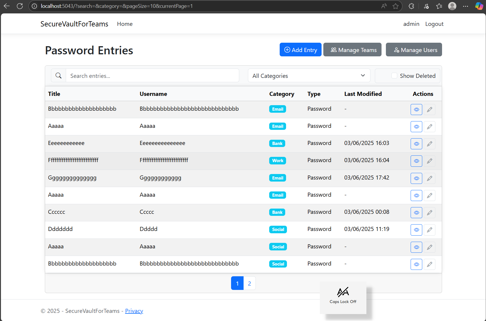

# SecureVault For Teams 0.3 Beta


SecureVaultForTeams is a web application for securely managing and sharing sensitive information (such as passwords, credentials, and secure notes) within teams. It is built with ASP.NET Core Razor Pages, uses LiteDB for storage, and supports team-based access control and administration.


## Features
- **Team-based password management**: Organize entries by teams, with each team having its own set of credentials and notes.
- **Role-based access**: Admin users can manage teams and entries, while regular users have restricted access.
- **CRUD for entries**: Create, view, edit, and delete password entries (Title, Username, Password, URL, Notes, Category, Team).
- **Team management**: Admins can create, edit, and delete teams.
- **Authentication**: Cookie-based login system with support for admin and user roles.
- **Responsive UI**: Built with Bootstrap for a modern, mobile-friendly interface.
- **API endpoints**: Minimal API for AJAX-based features (e.g., team editing modal).

## Installation
1. **Clone the repository**
   ```sh
   git clone https://github.com/yourusername/SecureVaultForTeams.git
   cd SecureVaultForTeams
   ```
2. **Restore dependencies**
   ```sh
   dotnet restore
   ```
3. **Build the project**
   ```sh
   dotnet build
   ```
4. **Run the application**
   ```sh
   dotnet run
   ```
5. **Access the app**
   Open your browser and navigate to `https://localhost:5043` (or the port shown in your terminal).

## Default Admin Login
- **Username:** admin
- **Password:** Admin123!

On first run, a default admin user and team are created automatically.

## Usage
- **Login** with the admin credentials.
- **Manage Teams**: Go to the Manage Teams page to create, edit, or delete teams.
- **Manage Entries**: Add, edit, or delete password entries for your teams.
- **Edit Team**: Use the Edit button in Manage Teams to open a modal and update team details.

## New Features (Beta)
- **Data Migration:** Admins can now export all data (users, teams, entries) to `Data/data.json` and import from it via the new `/MigrateData` page. This allows easy backup, migration, or restore of your vault data.
- **User Team Display:** The current user's teams are now shown in the navigation bar for quick context.
- **Improved Model Validation:** Only relevant form fields are validated, reducing false validation errors.

## Known Bugs & Limitations
- **ModelState Ghost Properties:** Some unused model properties may still appear in ModelState, but are now ignored for validation.
- **No granular import validation:** Importing from `data.json` will overwrite all existing data without preview or partial import.
- **No audit log:** Data migration actions are not logged.

## Usage Notes
- Only users with the Admin role can access the migration page (`/MigrateData`).
- The exported/imported file is always `Data/data.json`.
- After import, all previous data in LiteDB is replaced.

## Project Structure
- `Pages/` - Razor Pages for UI and logic
- `Controllers/` - API controllers for AJAX endpoints
- `Services/` - Business logic and data access (LiteDB)
- `Models/` - Data models (Entry, Team, User)
- `wwwroot/` - Static files (CSS, JS, Bootstrap, jQuery)

## TODO
- Implement User Management (add, edit, delete users, assign users to teams, manage roles)
- Add password strength validation and generation
- Add audit logging for sensitive actions
- Improve error handling and notifications
- Add support for multi-factor authentication (MFA)

---

Feel free to contribute or open issues for suggestions and bug reports!
